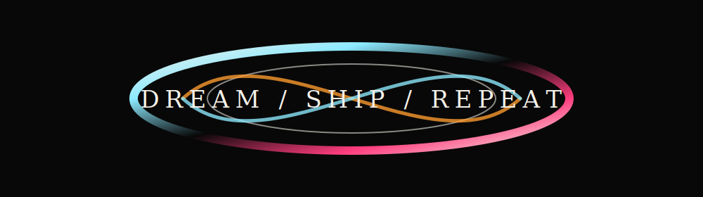

  

  
  

## Lightbrush Project

Lightbrush is a creative technology studio building projection work, real-time visual systems, 3D motion, and the software scaffolding behind the show.

This GitHub is the public edge of the studio: polished experiments, useful tools, visual research, and working code from the space between art, software, and live production.

  

## Signal

| Visual Systems | Studio Tools | Portfolio Work |
| --- | --- | --- |
| Projection mapping, VJ loops, shaders, spatial media, interactive environments. | Artist-facing automation, creative pipelines, docs, dashboards, and weird useful utilities. | Installations, motion studies, branded 3D pieces, experiments, and selected public drops. |

## Current Frequencies

- Building Lightbrush Studio systems for immersive visuals and installation workflows.
- Shipping portfolio pieces that make code feel physical.
- Exploring 3D animation, GLSL, WebGL, AI-assisted media, and live-control surfaces.
- Keeping the useful parts public when they can help another builder move faster.

## Stack

`Three.js` / `GLSL` / `Blender` / `Unreal` / `Resolume` / `TouchDesigner` / `ComfyUI` / `Python` / `React` / `Node` / `FFmpeg`

## Featured Public Work

| Project | What it is |
| --- | --- |
| [StellarGraph](https://github.com/lightbrushproject/StellarGraph) | Animated Obsidian graph view for agentic research vaults. |
| [awesome-solana-ai](https://github.com/lightbrushproject/awesome-solana-ai) | Public AI tooling index for builders working around Solana. |
| [awesome-solana-mcp-servers](https://github.com/lightbrushproject/awesome-solana-mcp-servers) | MCP server references for Solana-flavored agent workflows. |

## Portfolio

The cleaner gallery lives at [lightbrush.art](https://lightbrush.art). GitHub is where the machinery leaks through.

  

<!-- profile-refresh: 2026-05-26 -->
